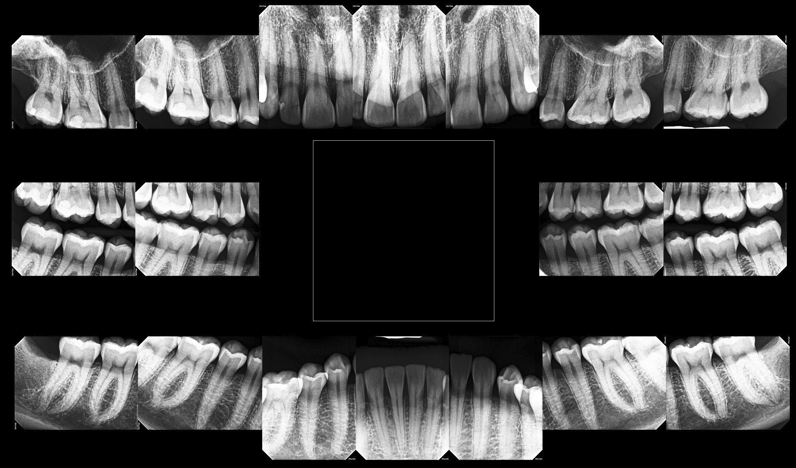
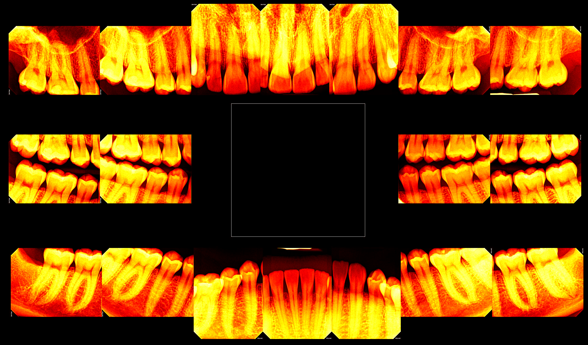
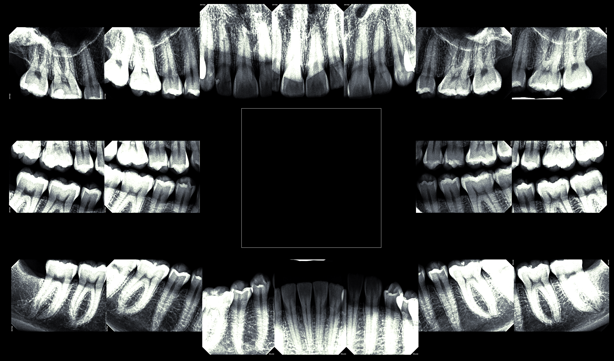

# xrayview

`xrayview` is a small image-visualization project with a Java desktop frontend and a Go processing backend.

The primary desktop UI now lives in `java-frontend/`. The Go CLI in `cmd/xrayview` is the backend processing entry point used by that Java frontend, and it also remains usable directly from the command line. The older Fyne-based Go GUI in `cmd/xrayview-gui` is still present as a transitional reference, but it is no longer the primary desktop path.

The Go backend loads a PNG or JPEG image, applies grayscale-oriented visualization steps, and writes a PNG output image. It can also produce pseudocolor output and side-by-side comparison images.

## What It Does

- Loads an input image from disk (`.png`, `.jpg`, `.jpeg`)
- Converts the image to grayscale
- Optionally applies invert, brightness, contrast, and histogram equalization
- Optionally applies a pseudocolor palette
- Optionally writes a side-by-side comparison image
- Saves the result as a PNG file

## Important Notice

This tool is for image visualization only.

It is **not** a medical device and must **not** be used for medical diagnosis, clinical decisions, or treatment planning.

## Build

```bash
go build -o /tmp/xrayview ./cmd/xrayview
```

## Java Frontend

The primary desktop UI is the JavaFX frontend:

```bash
mvn -f java-frontend/pom.xml package
mvn -f java-frontend/pom.xml javafx:run
```

## Transitional Go GUI

The repository also still includes the older Fyne GUI as a transitional / legacy reference:

```bash
go build ./cmd/xrayview-gui
go run ./cmd/xrayview-gui
```

It is not the primary desktop frontend going forward.

## Basic Usage

```bash
go run ./cmd/xrayview -input teeth-test.jpg
```

If `-output` is omitted, the tool writes a file next to the input using this pattern:

- `input.jpg` -> `input_processed.png`

## Flags

### Input

- `-input`
  - Path to the source image
  - Supports PNG and JPEG input

### Output

- `-output`
  - Output PNG path
  - Optional
  - Must end with `.png`
  - If omitted, `xrayview` generates `input_processed.png` in the same directory as the input

### Presets

- `-preset`
  - Named visualization preset
  - Supported values: `default`, `xray`, `high-contrast`
  - Presets set a combination of brightness, contrast, equalization, and palette
  - Explicit CLI flags override preset values

#### Preset summary

- `default`
  - brightness `0`
  - contrast `1.0`
  - equalize `false`
  - palette `none`

- `xray`
  - brightness `10`
  - contrast `1.4`
  - equalize `true`
  - palette `bone`

- `high-contrast`
  - brightness `0`
  - contrast `1.8`
  - equalize `true`
  - palette `none`

### Grayscale Filter Controls

- `-invert`
  - Inverts the grayscale image

- `-brightness`
  - Integer brightness delta
  - Positive values brighten the image
  - Negative values darken the image

- `-contrast`
  - Floating-point contrast factor
  - `1.0` leaves contrast unchanged
  - Values above `1.0` increase contrast
  - Values below `1.0` decrease contrast

- `-equalize`
  - Enables histogram equalization

### Comparison Output

- `-compare`
  - Writes a side-by-side comparison PNG
  - Left side: original grayscale image
  - Right side: processed output image
  - Output width becomes `2x` the original width

### Pipeline Ordering

- `-pipeline`
  - Comma-separated list of grayscale processing steps
  - Lets you control the order of enabled grayscale filters
  - Supported step names:
    - `grayscale`
    - `invert`
    - `brightness`
    - `contrast`
    - `equalize`

If `-pipeline` is omitted, the default order is:

```text
grayscale,invert,brightness,contrast,equalize
```

Notes:

- `grayscale` is always the starting point
- The pipeline only affects grayscale filter ordering
- Pseudocolor is applied after the grayscale pipeline
- Comparison output is applied after all processing

### Pseudocolor

- `-palette`
  - Pseudocolor palette for the final image
  - Supported values:
    - `none`
    - `hot`
    - `bone`

## Examples

### Basic processing

```bash
go run ./cmd/xrayview -input teeth-test.jpg
```

#### Explicit output file

```bash
go run ./cmd/xrayview -input teeth-test.jpg -output teeth-test_out.png
```

### Tone adjustments

#### Inverted grayscale with brightness adjustment

```bash
go run ./cmd/xrayview -input teeth-test.jpg -invert -brightness 15
```

#### Higher contrast with histogram equalization

```bash
go run ./cmd/xrayview -input teeth-test.jpg -contrast 1.6 -equalize
```

### Presets

#### Use a preset

```bash
go run ./cmd/xrayview -input teeth-test.jpg -preset xray
```

#### Use a preset but override one value

```bash
go run ./cmd/xrayview -input teeth-test.jpg -preset xray -brightness 5
```

### Pipeline ordering

#### Apply a custom grayscale step order

```bash
go run ./cmd/xrayview -input teeth-test.jpg -invert -contrast 1.5 -equalize -pipeline grayscale,contrast,invert,equalize
```

### Pseudocolor

#### Apply a pseudocolor palette

```bash
go run ./cmd/xrayview -input teeth-test.jpg -palette hot
```

### Comparison output

#### Write a before/after comparison image

```bash
go run ./cmd/xrayview -input teeth-test.jpg -compare
```

#### Comparison with processing and pseudocolor

```bash
go run ./cmd/xrayview -input teeth-test.jpg -preset xray -compare
```

## Example Outputs

### Grayscale vs equalized

```bash
go run ./cmd/xrayview -input teeth-test.jpg -output images/equalized.png -equalize
```



Caption: Histogram equalization spreads midtone detail more aggressively, which can make faint structures stand out compared with plain grayscale.

### Hot palette

```bash
go run ./cmd/xrayview -input teeth-test.jpg -output images/hot.png -palette hot
```



Caption: The hot palette maps low intensities to dark reds and high intensities to yellow-white, making intensity differences easier to spot quickly.

### Bone palette with preset

```bash
go run ./cmd/xrayview -input teeth-test.jpg -output images/bone.png -preset xray
```



Caption: The `xray` preset combines higher contrast, equalization, and the bone palette for a cooler X-ray-style presentation with brighter highlights.

## Before/After Comparison

When `-compare` is enabled, `xrayview` writes one combined PNG:

- Left half: the original image converted to grayscale
- Right half: the fully processed result

This makes it easier to inspect how the selected filters and palette change the image without opening two separate files.

## Validation Rules

- `-input` is required
- Output must be a `.png` file
- `-palette` must be `none`, `hot`, or `bone`
- `-preset` must be `default`, `xray`, or `high-contrast`
- `-pipeline` may only contain `grayscale`, `invert`, `brightness`, `contrast`, and `equalize`

## Test

```bash
go test ./...
```
